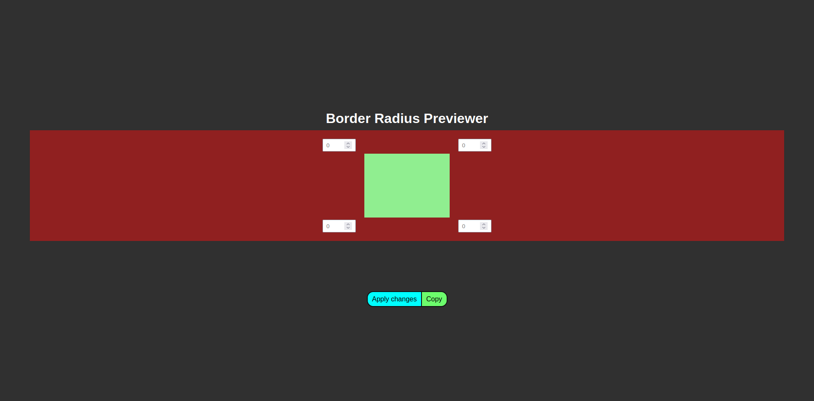

# Border-Radius Previewer
 Pre-Visualizador de CSS Border-Radius criado por mim usando HTML, CSS e JavaScript.
   
 
   
 Clique [aqui](https://gsggamer.github.io/border-radius-previewer) para acessar o site do projeto pronto.
